# SMFPlayer-Desktop Support Page

[English version](README.en.md)

## 概要
このアプリはSMF(Standard MIDI File)を読み込み、Macに接続されたMIDI機器へMIDIデータを送るためのアプリケーションです。

## 特徴
1. MIDIデータはアプリケーションが利用するストレージ領域にコピーして利用するので、オリジナルデータを編集・削除することはありません
2. 鍵盤表示で演奏情報をグラフィカルに表示します
3. お気に入りを集めたプレイリストを作ることができます

## 使い方
本アプリケーションをダウンロードし、初めて使うときは利用したいMIDIファイルを本アプリケーションに追加します。

その後は再生したり、お気に入りを集めたプレイリストを作ることができます。

### MIDIファイルをアプリケーションに取り込む
MIDIファイルをドラッグ＆ドロップでアプリケーションに追加します。

フォルダをドラッグ＆ドロップした場合は、フォルダの階層は維持された状態でアプリケーションに追加されます。

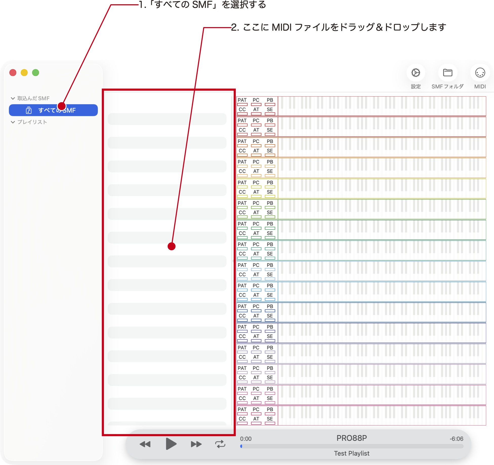

- 取り込んだファイルのリストは、アプリケーション上でFinderのように見ることができます
- ウィンドウ右上の「SMFフォルダ」ボタンを押すと、取り込んだファイルが保存されている場所をFinderで開くことができます
- MIDIファイル、フォルダはアプリケーションへのドラッグ＆ドロップでなく、Finder上で追加・削除してもアプリケーションに反映されます

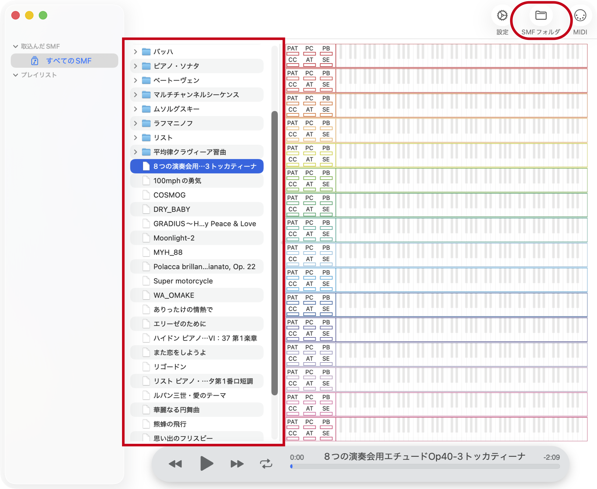

#### 取り込んだファイルの編集
取り込んだファイルはFinder上で移動・削除、フォルダ作成、ファイル名変更が可能ですが、アプリケーション上でも同じように編集ができます。

ファイルの移動はドラッグ＆ドロップで可能です。

以下の操作は「コントロール + クリック」、または「右クリック」でコンテキスト・メニューが現れます。

- ファイルをFinderで表示
- フォルダ作成
- ファイル・フォルダの名称変更
- ファイル・フォルダの削除

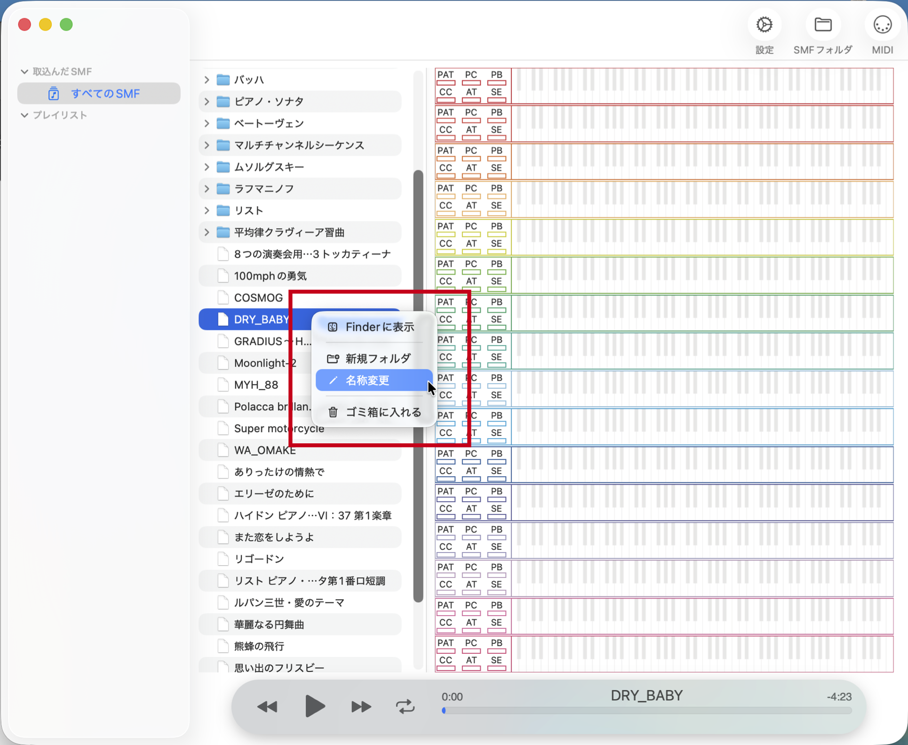

- フォルダ作成はメニューバーの「ファイル＞新規＞新規フォルダ」でも可能で、ショートカットも割り当てられています
- ファイルの削除はメニューバーの「編集＞削除」でも可能で、ショートカットも割り当てられています
- ファイル・フォルダの名称変更は、リストをクリックすると編集可能状態になります

### MIDIデバイスの選択
ウィンドウ右上の「MIDI」ボタンを押すと、Macに接続されているMIDIデバイスがポップアップリストで表示されます。

MIDIデータを送信したいデバイスを選択してください。

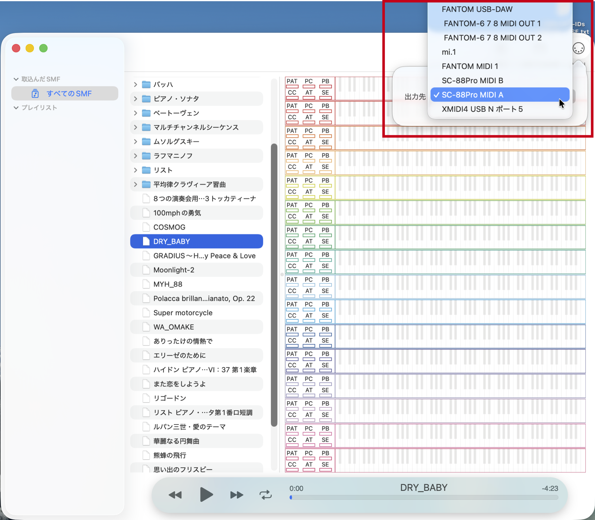

### MIDIファイルを再生する
再生したいファイルを選択し、再生ボタンを押すとMIDIファイルが再生されます。

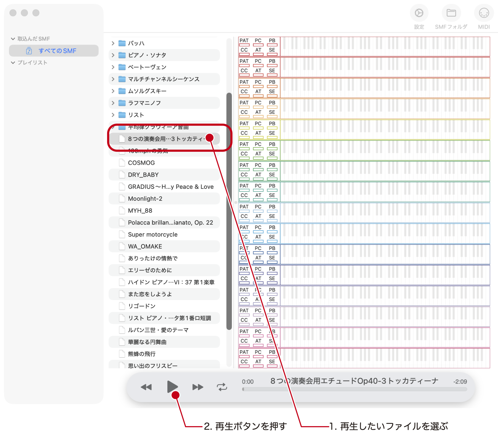

### 再生コントロール

- 再生しているファイル名が再生コントロール幅に収まらない場合は、スクロールしてファイル名を表示します
- リピートモードボタンでは、リピート・1曲リピート・リピートなしを選ぶことができます
- フォワードボタン、リワインドボタンで再生中の曲の前後の曲へ移動することができます
- 「control + click」でコンテキストメニューが現れ、ミニプレーヤーに切り替えることができます

## プレイリスト
Finderから取り込んだMIDIファイルから、お気に入りを集める「プレイリスト」を作ることができます。

### 新規プレイリスト
サイドバー上でコンテキスト・メニューが表示されます。

「新規プレイリスト」を選択すると、新しいプレイリストが作られます。

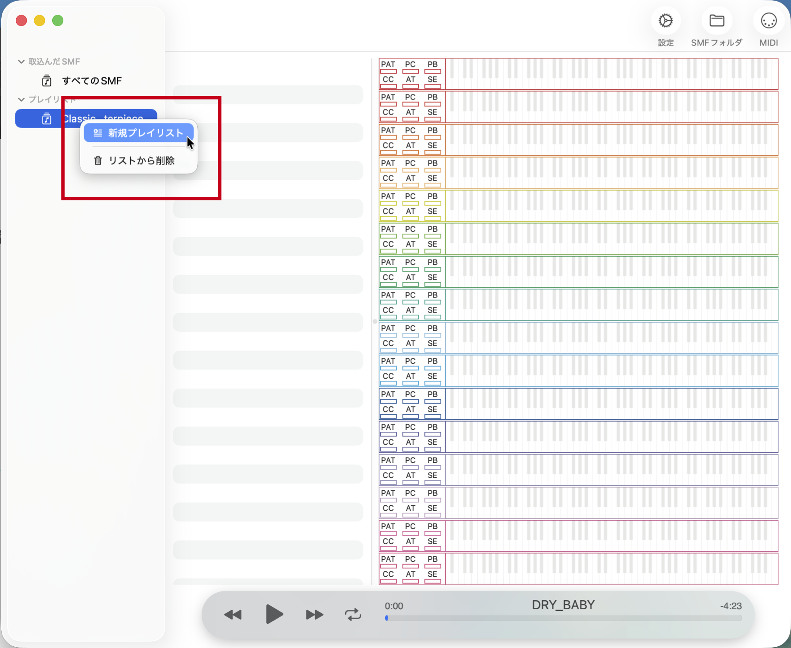

また、「ファイル＞新規＞新規プレイリスト」でも新しいプレイリストを作ることができます。

### プレイリストに曲を追加する
サイドバーの「すべてのSMF」をクリックし、アプリケーションに取り込まれたファイルを表示します。

表示されたファイルのリストからプレイリストに追加したい曲を選択し、追加したいプレイリストにドラッグ＆ドロップします。

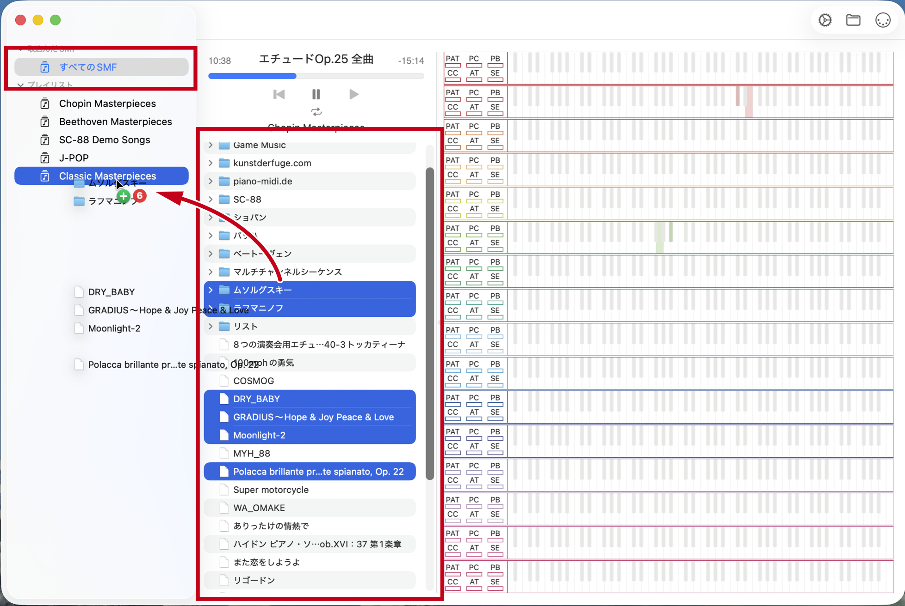

「すべてのSMF」のリストからファイル、フォルダを選択してプレイリストにドラッグ＆ドロップできます。

フォルダをドラッグ＆ドロップした場合、フォルダの中にあるすべてのファイルが追加されますが、ディレクトリ階層は無くなります。

### プレイリストの編集
#### 曲順の変更
順番を変更したいファイルを選択し、ドラッグ＆ドロップで入れ替えることができます。

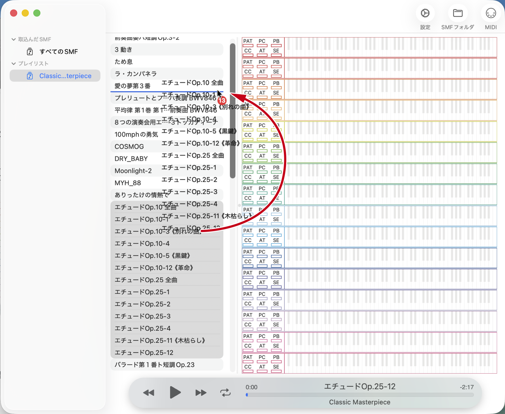

#### 曲の削除
削除したい曲を選択し、コンテキストメニューから「リストから削除」を選択します。

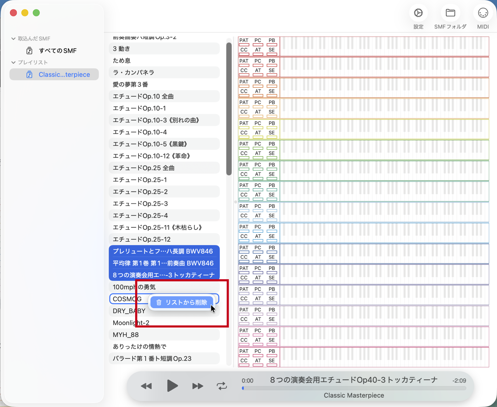

#### プレイリストの名称変更
プレイリストの名称をクリックすると編集可能な状態になります。

新しいプレイリスト名称を入力して、returnまたはenterキーで編集を終了します。

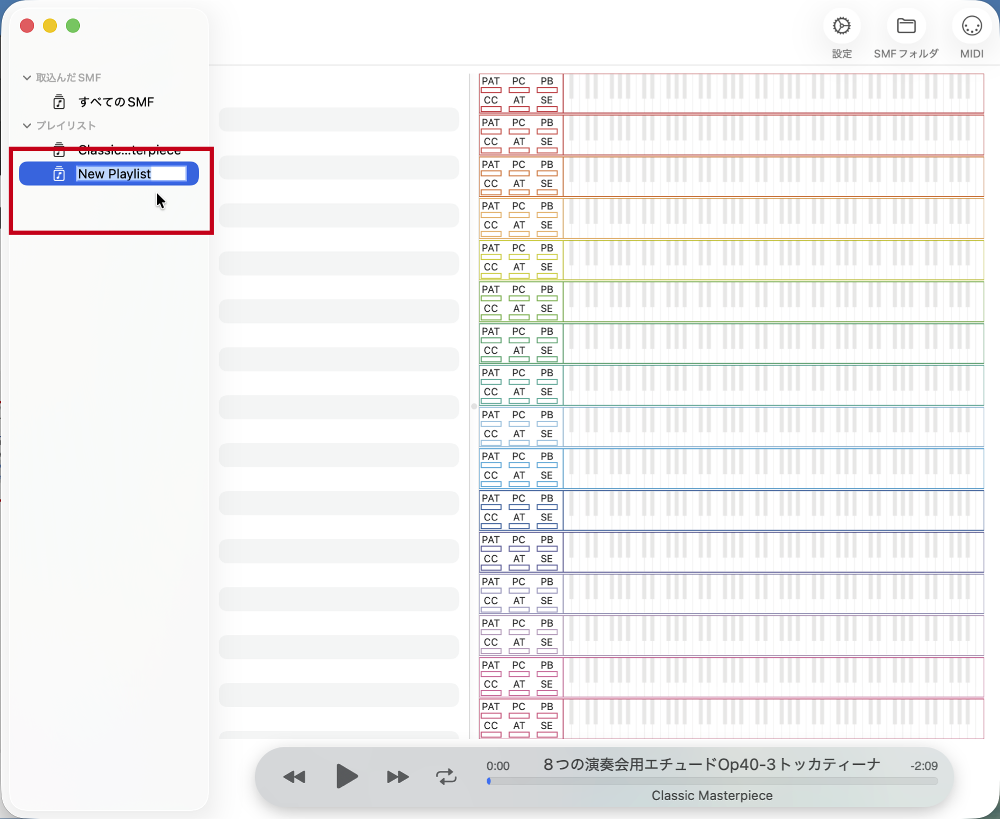

#### プレイリストの並べ替え
順番を変更したいプレイリストを選択し、ドラッグ＆ドロップで入れ替えることができます。

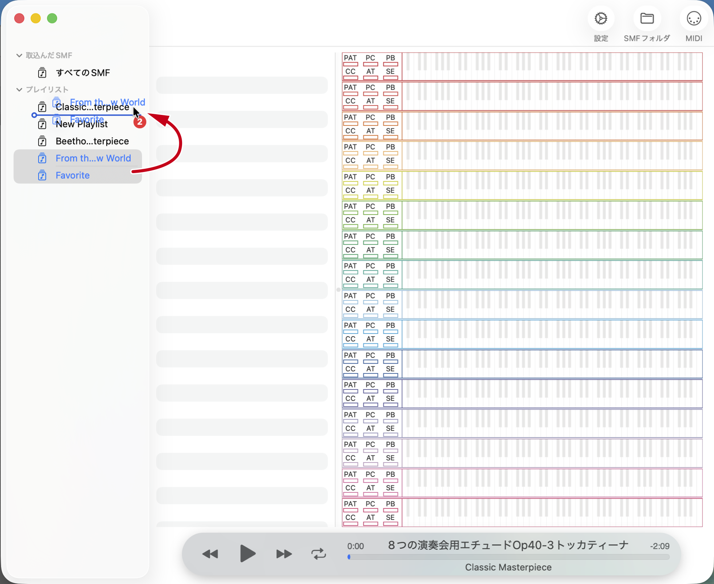

#### プレイリストの削除
削除したいプレイリストを選択し、コンテキスト・メニューから「リストから削除」を選択します。

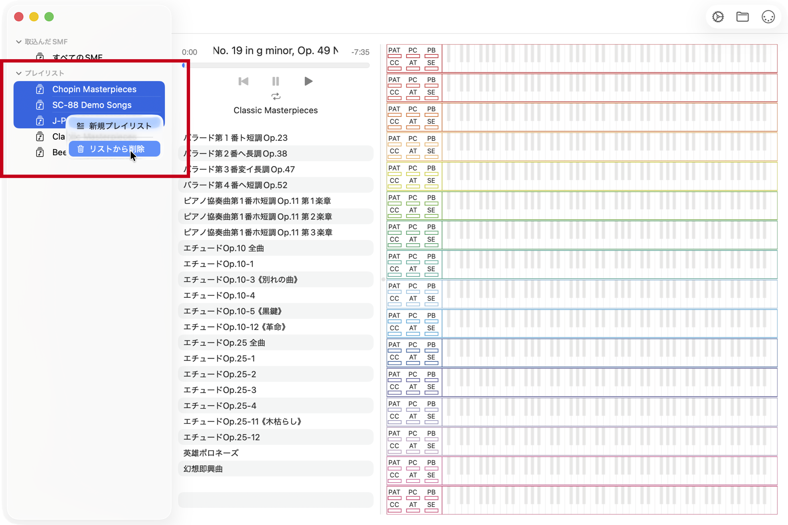

## 設定
ウィンドウ右上の「設定」ボタンをクリックすると、設定内容を表示するポップオーバーが表示されます。

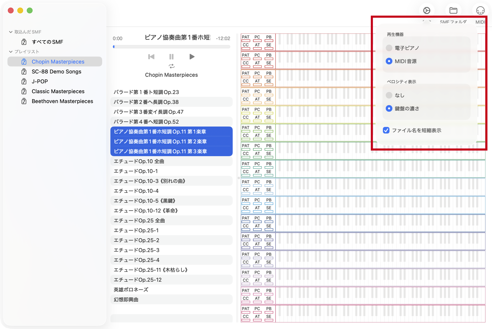

### 再生機器
#### 電子ピアノ
Macに接続されているMIDI機器が電子ピアノの場合、必要であればこれを選択します。

ピアノ曲のMIDIファイルの中には、和声を複数のチャンネルに分割して作られているものがあります。

多くの電子ピアノはどのMIDIチャンネルで送信しても同一MIDIチャンネル1として扱うようになっています。

しかし、そうなっていない電子ピアノの場合は、MIDIチャンネル1のデータしか再生されません。

そこで、この設定にしておくと、SMFPlayerはすべてのMIDIデータをチャンネル1に変換して送信します。
#### MIDI音源
SMFPlayerは何のデータ変換もせず、MIDI機器にMIDIデータを送信します。

通常はこの設定にしておけば良いでしょう。

### ベロシティ表示
鍵盤を押す強さの表示方法を選べます。

「鍵盤の濃さ」を選ぶと、鍵盤を押した強さに応じて色の濃さが変わります。

「なし」では常に一番濃い色で表示されます。

### ファイル名を短縮表示
主にクラシック音楽の時に利用します。

この設定のチェックボックスにチェックを入れると、ファイルが置かれているディレクトリの名称が、ファイル名の先頭に含まれていた場合、含まれている文字列を省略して表示します。

狭い幅で多くの曲情報を表示したい時に便利です。

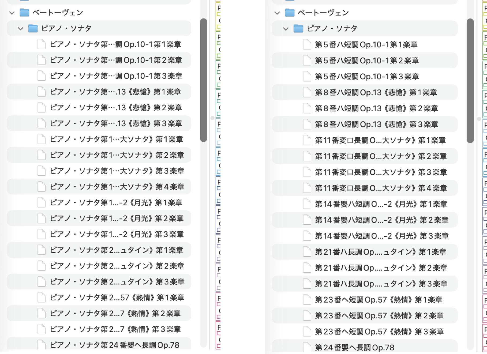

## メディア
[YouTube (SMFPlayer Desktop Quick Start Guide)](https://youtu.be/ZjoeS2dyPVk)